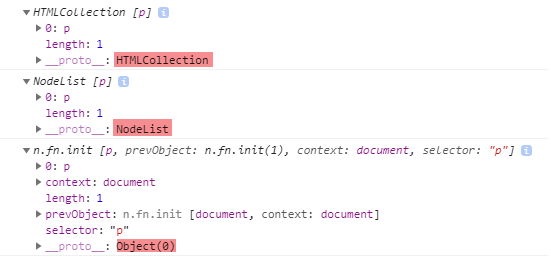

## 1주차 JS DOM & jQuery DOM

### 요약
* HTML 문서 내의 요소(element)와 속성, 내용(text) 등을 구조적으로 표현하는 방식을 제공하는 것을 DOM(Document Object Model)이라고 합니다.
* DOM을 통해 스크립트가 문서 내의 모든 요소에 동적으로 접근할 수 있습니다.
* 순수 Javascript로 DOM을 접근하게 되면, 다수의 반목문과 긴 스크립트를 작성해야 하는 경우가 많습니다.
* jQuery로는 CSS 선택자(Selector)방식을 사용해서 DOM에 접근하기 때문에 간단한 문법을 이용할 수 있다는 장점이 있습니다.

### JS DOM 접근 vs jQuery DOM 접근

| &nbsp; | javascript | jQuery |
| --- | :---: | :---: |
| id 선택자 | $("#foo") | document.getElementById("foo") 또는 document.querySelector("#foo") |
| class 선택자 | $(".foo") | document.getElementsByClassName("foo") 또는 document.querySelectorAll(".foo") |
| tag 선택자 | $("span") | document.getElementsByTagName("span") 또는 document.querySelectorAll("span") |
| 속성 선택자 | $("[name=foo]") | document.getElementsByName("foo") 또는 document.querySelectorAll("[name=foo]") |

### 참고
* jQuery 선택자를 통해 반환된 객체는 __jQuery 객체__ 입니다.
* document.getElementsByTagName을 통해 반환된 객체는 __HTMLCollection__ 입니다.
* document.querySelectorAll을 통해 반환된 객체는 __NodeList__ 입니다.

##### CODE

```javascript
	$(function(){
		var a = document.getElementsByTagName("p");
		console.log(a);

		var b = document.querySelectorAll("p");
		console.log(b);

		var c = $("p");
		console.log(c);
	});
```

##### RESULT

